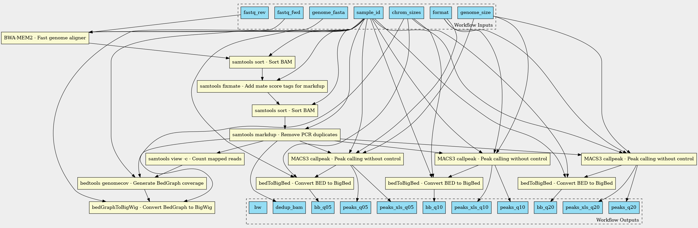
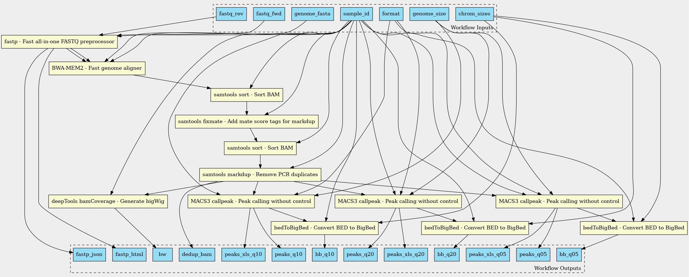
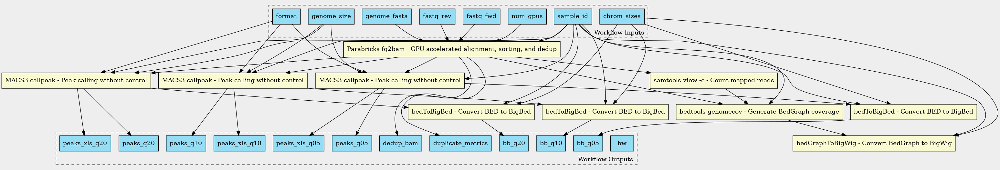

# ChIP-Atlas Pipeline v2: Upgrade Plan

## Status Overview

| Phase | Status | Summary |
|-------|--------|---------|
| 1. Benchmarking & Tool Selection | [x] Done | bwa-mem2 + Parabricks evaluated, --nomodel validated |
| 2. CWL Workflow Development | [x] Done | Option A (3 variants) + Option B (2 variants), CWL Zen refactored |
| 3. Secondary Analysis | [x] Done | Target genes + colocalization (static JSON) + enrichment (compiled BED) |
| 4. Validation | [x] Done | 2x2 matrix (ce11), Option A vs v1 (ce11 + hg38), peak overlap analysis |
| 5. Production Deployment | [ ] In progress | NIG benchmark in progress |
| CWL Zen Runner | [ ] Design done | Spec + lint tool complete, Rust implementation not started |

See [Benchmark Results](benchmark-results.md) for detailed data and [Progress Log](progress-log.md) for chronological record.

### Remaining TODO

**Next steps:**
- [ ] Run NIG supercomputer benchmark (script ready: `scripts/nig-setup-and-benchmark.sh`)
- [x] ~~Enrichment analysis~~ -- compiled BED + bedtools intersect, <1 sec per query
- [x] ~~Add instrument filter to sample selection~~ -- regex on title field, excluded instruments logged

**Future:**
- [ ] CWL Zen runner implementation (Rust, separate repo: [cwl-zen](https://github.com/inutano/cwl-zen))
- [ ] CUT&Tag support (SEACR peak caller)
- [ ] Benchmark remaining genomes (dm6, mm10, rn6) -- can run on NIG
- [ ] Process 10K+ remaining unprocessed samples on NIG
- [ ] Full 400K+ sample reprocessing

**Resolved:**
- [x] ~~Option A vs B comparison~~ -- Option B recommended (faster, more robust)
- [x] ~~SRX25595131 outlier~~ -- multi-run download issue, fixed with `download-experiment.sh`
- [x] ~~CWL JavaScript elimination~~ -- all 20 CWL files JS-free (CWL Zen compatible)
- [x] ~~Target genes analysis~~ -- JSON + HTML template, demo on GitHub Pages
- [x] ~~Colocalization analysis~~ -- H/M/L scoring + HTML template, demo on GitHub Pages
- [x] ~~Fast download~~ -- aria2c + ENA/DDBJ routing tested (2.5x faster)
- [x] ~~CWL runner language choice~~ -- Rust

---

## Documentation

| Document | Description |
|----------|-------------|
| [README](../README.md) | Project overview and quick start |
| [Benchmark Results](benchmark-results.md) | Performance data, comparisons, and analysis |
| [Progress Log](progress-log.md) | Chronological development record |
| [Cluster Setup Guide](cluster-setup-guide.md) | HPC deployment instructions |
| [CWL Zen Design](cwl-zen-design.md) | JavaScript-free CWL specification |
| [Secondary Analysis Plan](secondary-analysis-plan.md) | Target genes, colocalization, enrichment |
| [Current Pipeline](current-pipeline.md) | v1 pipeline documentation |

---

## Design Philosophy

The original ChIP-Atlas pipeline was intentionally minimal: because each sample has a different experimental setup (antibody, cell type, protocol, sequencing depth), per-sample optimization is impractical at scale. The v1 pipeline applies the same basic processing to all samples uniformly -- this simplicity is a feature, not a limitation.

For v2, we propose **two pipeline options** to evaluate the tradeoff between speed and modernization:

### Option A: "Fast Classic" -- Same steps, faster tools

Preserve the v1 processing logic exactly (same steps, same parameters where possible), but replace each tool with its modern equivalent for speed. No new steps added.

**Pros:**
- Results most comparable to v1 -- easier to validate continuity
- Minimal risk of introducing new biases
- Respects the original design rationale (uniform basic processing)
- Simpler to implement and maintain

**Cons:**
- Misses potential quality improvements (e.g., adapter trimming)
- Does not leverage experiment-type-specific best practices
- Some quality issues in v1 data will persist

### Option B: "Modern" -- Updated steps and best practices

Modernize the full pipeline: add QC/trimming, use experiment-type-specific peak callers, and apply current best practices.

**Pros:**
- Higher quality results per sample
- Experiment-type-aware processing (ChIP-seq vs ATAC-seq vs CUT&Tag)
- Aligns with current community standards
- Better for new experiment types like CUT&Tag

**Cons:**
- Results will differ more from v1 -- harder to validate continuity
- Added complexity in workflow branching per experiment type
- Risk of introducing biases that affect cross-sample comparisons
- More parameters to tune and maintain

### Evaluation Strategy

1. Implement both Option A and Option B as separate CWL workflows
2. Run both on the same representative sample set
3. Compare results: A vs v1, B vs v1, and A vs B
4. Decide which to adopt for production (or run both for different use cases)

---

## Important Policy: No Background/Input Control in Peak Calling

ChIP-Atlas intentionally performs peak calling **without background data** (input DNA / negative control). This is a deliberate design decision, not an oversight:

- **Why**: At the scale of 400K+ experiments from public repositories, it is impractical to reliably identify and pair each ChIP sample with its corresponding input control. Input data is often unavailable, mislabeled, or not explicitly described in the SRA metadata.
- **How it works**: MACS2/MACS3 is run without a control BAM. Instead, peaks are called against a local background model, and users filter results using three q-value thresholds (1e-05, 1e-10, 1e-20) to control stringency.
- **This is a defining characteristic of ChIP-Atlas** -- it enables uniform processing of all public data regardless of whether controls exist.
- **v2 must preserve this policy**: Both Option A and Option B must call peaks without background/input control. Do not implement control pairing logic.

---

## Goals

1. **Dramatically reduce processing time** (currently ~1 day/sample)
2. **Modernize tools** -- replace decade-old versions
3. **GPU acceleration** where beneficial
4. **CWL-based orchestration** -- portable, reproducible, runner-agnostic
5. **Custom CWL runner** -- minimal, fastest, flexible for any infrastructure
6. **Full scope** -- rewrite both primary processing and secondary analyses
7. **Support new experiment types** -- CUT&Tag in addition to ChIP-seq/DNase-seq/ATAC-seq/Bisulfite-seq
8. **Validate against v1** -- compare peak counts and overlap to understand differences

## Phase 1: Benchmarking & Tool Selection [x]

### 1.1 ~~Profiling the v1 Pipeline~~ (Skipped)

Reproducing v1 behavior is impractical -- many variables and file paths are hardcoded or implicitly declared in the original shell scripts. Instead, we will:

- Build the new pipelines (Option A and B) directly
- Benchmark per-step timing on the new pipelines
- Compare outputs against existing v1 results already available on chip-atlas.dbcls.jp
- The new pipeline will be faster regardless; profiling v1 is not worth the effort

### 1.2 Aligner Evaluation

Run all three on the same sample set, measure speed, memory, and alignment quality:

| Aligner | Type | Notes |
|---------|------|-------|
| bwa-mem2 | CPU (AVX-512) | Fastest CPU aligner, drop-in BWA replacement |
| minimap2 | CPU | Versatile, fast, future-proof for long reads |
| Parabricks (GPU BWA-MEM) | GPU (NVIDIA) | Extremely fast, commercial license required |

Metrics to compare:
- Wall time per sample
- Peak memory usage
- Mapping rate vs. Bowtie2 v1 baseline
- Downstream peak call consistency

See [Benchmark Results](benchmark-results.md) for timing data and comparisons.

### 1.3 Tool Mapping: Option A vs Option B

| Step | v1 Tool | Option A (Fast Classic) | Option B (Modern) |
|------|---------|------------------------|-------------------|
| SRA download | SRA Toolkit 2.3.2-4 | SRA Toolkit latest (fasterq-dump) | Same as A |
| FASTQ QC | (none) | (none) | fastp (QC + trimming in one pass) |
| Trimming | (none) | (none) | fastp |
| Alignment | Bowtie2 2.2.2 | bwa-mem2 / minimap2 / Parabricks | Same as A |
| BAM processing | SAMtools 0.1.19 | SAMtools latest (1.20+) | Same as A |
| Duplicate removal | samtools rmdup | samtools markdup | Same as A |
| Coverage tracks | bedtools 2.17.0 + bedGraphToBigWig | bedtools latest + bedGraphToBigWig | deeptools bamCoverage (BAM->BigWig direct) |
| Peak calling | MACS2 2.1.0 (all types) | MACS3 (all types) | MACS3 (ChIP-seq), HMMRATAC (ATAC-seq), SEACR (CUT&Tag) |
| Format conversion | UCSC bedToBigBed | UCSC tools latest | Same as A |

**Key difference**: Option A keeps the same steps as v1 (no QC, no trimming, single peak caller for all types). Option B adds QC/trimming and uses experiment-type-specific peak callers.

### Pipeline Diagrams

**Option A "Fast Classic" (CPU, --nomodel):**



**Option B "Modern" (CPU):**



**Option A Parabricks (GPU):**



### 1.4 CUT&Tag Considerations (Option B only)

- CUT&Tag has lower background than ChIP-seq -- SEACR is the recommended peak caller
- Separate peak-calling branch in the CWL workflow
- Alignment parameters may differ (e.g., fragment size expectations)

## Phase 2: CWL Workflow Development [x] Option A / [ ] Option B

### 2.1 Workflow Structure

```
chip-atlas-pipeline-v2/
├── cwl/
│   ├── tools/                        # CWL CommandLineTool definitions (one per tool)
│   │   ├── fasterq-dump.cwl
│   │   ├── bwa-mem2.cwl
│   │   ├── fastp.cwl                 # Option B only
│   │   ├── samtools-sort.cwl
│   │   ├── samtools-markdup.cwl
│   │   ├── macs3-callpeak.cwl
│   │   ├── deeptools-bamcoverage.cwl  # Option B only
│   │   ├── bedtools-genomecov.cwl     # Option A only
│   │   ├── bedgraphtobigwig.cwl
│   │   ├── bedtobigbed.cwl
│   │   └── ...
│   ├── workflows/
│   │   ├── option-a.cwl              # Fast Classic: same steps as v1, modern tools
│   │   ├── option-b.cwl              # Modern: QC + trimming + type-specific callers
│   │   ├── target-genes.cwl          # Secondary: peak-TSS overlap
│   │   ├── colocalization.cwl        # Secondary: co-binding analysis
│   │   ├── enrichment.cwl            # Secondary: in silico ChIP
│   │   └── full-pipeline.cwl         # Top-level: primary + secondary
│   └── inputs/
│       ├── hg38.yml                  # Per-genome input templates
│       ├── mm10.yml
│       └── ...
├── containers/
│   ├── Singularity.bwa-mem2
│   ├── Singularity.macs3
│   ├── Singularity.fastp
│   └── ...
├── scripts/
│   ├── batch-submit.sh               # Submit multiple samples
│   ├── metadata-filter.py            # SRA metadata filtering (replace shell logic)
│   └── validate-vs-v1.py             # Consistency comparison tool
├── docs/
│   ├── current-pipeline.md
│   └── v2-plan.md
└── tests/
    ├── test-samples.yml               # Representative sample set for testing
    └── expected/                      # Expected outputs for CI
```

### 2.2 CWL Design Principles

- **CWL v1.2** spec
- One `CommandLineTool` per tool -- granular, reusable, testable
- `Workflow` documents compose tools into pipelines
- `scatter` for parallel execution across samples
- All tools wrapped in Singularity containers
- Input/output types strictly defined for validation
- Test with **cwltool** initially
- Option A and Option B share the same tool definitions, differ only at workflow level

### 2.3 Custom CWL Runner (sub-project)

- Minimal implementation -- support CWL v1.2 subset needed by this pipeline
- Direct job submission to SLURM/SGE/local without intermediate layers
- Singularity-native (no Docker translation layer)
- Parallel step execution with dependency resolution
- Designed for throughput at scale (400K+ samples)
- Language TBD (Rust? Go? Python?)

## Phase 3: Secondary Analysis Rewrite [x]

### 3.1 Target Gene Analysis

- Replace shell + bedtools with CWL workflow
- Use bedtools latest for peak-TSS overlap
- Rewrite STRING integration in Python
- Output: TSV tables

### 3.2 Colocalization Analysis

- Replace custom Java tool (`coloCA.jar`) with Python implementation
- Same algorithm: Gaussian fit -> Z-score groups -> pairwise scoring
- Integrate STRING scores
- Wrap as CWL CommandLineTool

### 3.3 Enrichment / In Silico ChIP

- Rewrite in Python with CWL wrapper
- bedtools intersect + scipy for Fisher's exact test
- BH correction via statsmodels

## Phase 4: Validation [x] Option A / [ ] Option B

### 4.1 Sample Selection

Source: `https://chip-atlas.dbcls.jp/data/metadata/experimentList.tab`

#### Stratification Dimensions

1. **Genome** (6 current assemblies, legacy assemblies skipped):
   - hg38, mm10, rn6, dm6, ce11, sacCer3

2. **Experiment type** (6 types):
   - Histone, TFs and others, ATAC-Seq, DNase-seq, RNA polymerase, Bisulfite-Seq
   - Skip: Input control, Unclassified, No description, Annotation tracks

3. **Read count tier** (based on column 8, first comma-separated value):
   - Low: <10M reads
   - Medium: 10-50M reads
   - High: >50M reads

#### Selection Method

- For each **genome x experiment type x read tier** combination:
  - Sort by accession number descending (newer experiments first -- biases toward modern sequencing instruments)
  - Pick **3 samples** from the top
- This ensures multiple samples per organism to capture genome-structure-related variation in mapper/peak-caller behavior
- **Expected size**: up to ~270 samples (6 genomes x 6 types x 3 tiers x 3 samples), fewer where combinations are sparse

#### Selection Script

`scripts/select-validation-samples.py` -- reads experimentList.tab, applies filters and stratification, outputs the selected sample list to `data/validation-samples.tsv`

### 4.2 Three-Way Comparison

| Comparison | Purpose |
|------------|---------|
| Option A vs v1 | Validate that tool upgrades alone don't break results |
| Option B vs v1 | Understand impact of added QC/trimming/type-specific callers |
| Option A vs Option B | Isolate the effect of modernization steps |

Metrics:
- **Peak count**: number of peaks at each q-value threshold
- **Peak overlap**: Jaccard index and overlap coefficient
- **Exploratory**: visualize differences before setting pass/fail thresholds
- Optionally: BigWig signal correlation (Pearson/Spearman) at later stage

See [Benchmark Results](benchmark-results.md) for detailed comparison data.

### 4.3 Validation Tooling

- `validate-vs-v1.py`: takes two BED files, reports peak count, overlap stats, generates comparison plots
- Run as part of the test suite

---

## Phase 5: Production Deployment & Migration [ ]

### 5.1 Decision Point

After Phase 4 validation, decide:
- **Adopt Option A** if consistency with v1 is paramount
- **Adopt Option B** if quality improvements justify the differences
- **Run both** if different use cases need different tradeoffs

### 5.2 Storage Estimation

#### Per-sample output sizes

| Genome | BigWig (avg) | BED/BigBed (3 thresholds) | Total per sample |
|--------|-------------|--------------------------|-----------------|
| hg38 | 278 MB | ~7 MB | ~285 MB |
| mm10 | 230 MB | ~5 MB | ~235 MB |
| rn6 | ~200 MB | ~5 MB | ~205 MB |
| dm6 | ~100 MB | ~3 MB | ~103 MB |
| ce11 | 78 MB | ~2 MB | ~80 MB |
| sacCer3 | ~10 MB | ~1 MB | ~11 MB |

#### Total storage by genome (432K samples)

| Genome | Samples | Per sample | Total |
|--------|---------|-----------|-------|
| hg38 | 197,044 | 285 MB | ~55 TB |
| mm10 | 194,162 | 235 MB | ~44 TB |
| sacCer3 | 16,547 | 11 MB | ~0.2 TB |
| dm6 | 15,067 | 103 MB | ~1.5 TB |
| ce11 | 6,862 | 80 MB | ~0.5 TB |
| rn6 | 2,958 | 205 MB | ~0.6 TB |
| **Total** | **432,640** | | **~102 TB** |

#### Transition plan

1. **Announce v2 transition** -- set 6-month window for users to download v1 data
2. **During transition (~6 months)**: serve both v1 and v2 data (~204 TB)
3. **After transition**: archive v1 to Glacier Deep Archive, serve only v2 (~102 TB)
4. **Provide v1 CWL pipeline** -- users who need v1 results can re-run the pipeline themselves (CWL is reproducible)

#### AWS S3 storage costs

| Storage class | 102 TB (v1 or v2) | 204 TB (transition) | Notes |
|--------------|-------------------|--------------------|----|
| S3 Standard | $2,346/month ($28K/year) | $4,692/month ($56K/year) | Active serving |
| S3 Infrequent Access | $1,280/month ($15K/year) | $2,560/month ($31K/year) | Less frequent access |
| S3 Glacier Deep Archive | **$101/month ($1.2K/year)** | **$202/month ($2.4K/year)** | Cold storage, retrieval takes hours |

**Recommended approach:**
- **v2 production data**: S3 Standard or host on existing infrastructure (~$28K/year on S3)
- **v1 archive**: Glacier Deep Archive during transition ($101/month), delete after 6 months
- **v1 CWL pipeline**: published on GitHub (no storage cost), users re-run if needed
- **Total annual cost**: ~$29K/year for v2 on S3, or ~$0 if hosted on NIG/DBCLS infrastructure

### 5.3 Incremental Rollout

1. Process the 10K+ remaining unprocessed samples with Option B
2. Reprocess a subset of existing 400K samples for validation
3. Full reprocessing on NIG supercomputer (~50-70 days with 78 CPU nodes)

### 5.4 Update Infrastructure

- Metadata filtering: rewrite in Python (replace shell scripts)
- Incremental update logic: detect new SRA accessions, queue for processing
- Data distribution: same URL structure for backward compatibility
- Multi-run download: use `download-experiment.sh` to handle SRX->SRR resolution

## Timeline

1. [x] **Benchmarking** -- bwa-mem2/Parabricks evaluated, --nomodel validated, 2x2 matrix complete
2. [x] **CWL workflows** -- Option A (3 variants) + Option B (2 variants), all CWL Zen (JS-free)
3. [x] **Validation** -- A vs v1 (ce11+hg38), A vs B (ce11), peak overlap analysis, multi-threshold
4. [x] **Secondary analyses** -- target genes + colocalization (scripts + templates + demo pages)
5. [ ] **NIG supercomputer test** -- in progress
6. [x] **Enrichment analysis** -- compiled BED + bedtools intersect, <1 sec per query
7. [ ] **CWL Zen runner** -- Rust implementation (separate repo)
8. [ ] **Production reprocessing** -- 400K+ samples on NIG

## Instrument Filtering & Long Read Support

### Current state (2026-03)

ChIP-Atlas data is overwhelmingly Illumina short-read:
- ~147K samples with instrument info in title: 99.9% Illumina (HiSeq, NextSeq, NovaSeq, MiSeq)
- 6 MGI/DNBSEQ samples
- 0 PacBio/ONT samples (one PacBio Bisulfite-Seq found via SRA XML, not in title)

Long-read ChIP-seq/ATAC-seq (e.g., nanoCUT&Tag) is emerging but not yet in public data at scale.

### Decision

- **Filter out non-Illumina samples** for v2 processing -- add instrument check to sample selection
- **Log non-Illumina samples** to a separate file for monitoring growth
- **Architecture supports future long reads** -- adding `minimap2.cwl` is trivial, pipeline can branch by aligner parameter
- **Revisit when >100 long-read ChIP/ATAC samples** appear in SRA

## Open Questions

- [ ] Parabricks licensing on NIG -- is L40S supported? Need to test
- [ ] CUT&Tag peak caller -- SEACR vs MACS3 for CUT&Tag data
- [ ] Data storage strategy -- host v2 on existing DBCLS infra or S3?
- [ ] Why hg38 shows near-parity with v1 while ce11 shows 1.5x more peaks
- [x] ~~Job scheduler~~ -- SLURM (confirmed on NIG)
- [x] ~~CWL runner language~~ -- Rust
- [x] ~~SRX25595131 outlier~~ -- multi-run download issue
- [x] ~~Instrument filtering~~ -- filter non-Illumina, log for monitoring
